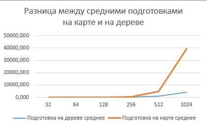

# Лабораторная работа по алгоритмам и структурам данных №2 
### Петрова Мария 22ПИ2 
Логин yandex.contest: mnpetrova_1@edu.hse.ru
## Алгоритм перебора 
Реализуется без подготовки. Для поиска достаточно проверить принадлежит ли точка всем прямоугольникам.
```python
def bruteforce(rectangles: list[Rectangle], point: Point):
    p = point
    res = 0
    for r in rectangles:
        if r.x1 <= p.x < r.x2 and r.y1 <= p.y < r.y2:
            res += 1
    return res
```
Сложность поиска одной точки - O(n), где n - количество прямоугольников
## Алгоритм на карте
Для подготовки сначала необходимо сжать координаты прямоугольников и разместить их в матрице, заполняя соответствующие 
ячейки количеством прямоугольников.
```python
def compressCord(rectangles: list[Rectangle]):
    compressX = set()
    compressY = set()
    for rect in rectangles:
        compressX.update([rect.x1, rect.x2])
        compressY.update([rect.y1, rect.y2])
    return sorted(list(compressX)), sorted(list(compressY))
```
```python
def createMap(rectangles: list[Rectangle], compress: Compress):
    cordMap = numpy.zeros((len(compress.y), len(compress.x)), dtype=int)
    for rect in rectangles:
        for i in range(compress.y.index(rect.y1), compress.y.index(rect.y2)):
            for j in range(compress.x.index(rect.x1), compress.x.index(rect.x2)):
                cordMap[i][j] += 1
    return cordMap
```
После для ответа скольким прямоугольникам принадлежит точка достаточно просто на какой сжатой координате лежит точка.
```python
for p in point:
        ans = 0
        if compress.x[0] <= p.x < compress.x[-1] or compress.y[0] <= p.y < compress.y[-1]:
            ans = cordMap[find(compress.y, p.y)][find(compress.x, p.x)]
        res.append(ans)
```
Сложность подготовки - O(n^3). Сложность поиска точек - O(logn)
На большем количестве квадратов подготовка начинает занимать очень много времени. Оптимально использовать не более 512 
прямоугольников, в идеале - не больше 256. Однако этот алгоритм может быть полезен в долгосрочной перспективе, так как 
поиск точек почти не занимает времени.

 
## Алгоритм на дереве
Для подготовки необходимо сжать координаты, аналогичным путем, что и в алгоритме на карте и создать пустое дерево 
отрезков длины количества сжатых координат по y. После обновлять элементы в массиве с корнями деревьев в соответствии 
со сжатыми координатами по x. 
```python
def createTree(left, right):
    if left > right:
        return None
    if left == right:
        return Node(0, None, None, left, right)
    leftChild = createTree(left, (left + right) // 2)
    rightChild = createTree((left + right) // 2 + 1, right)
    return Node(0, leftChild, rightChild, left, right)
```
```python
def updateTree(node: Node, left, right, value):
    if node.intervalL == node.intervalR:
        update = copy.copy(node)
        update.value += value
        return update

    conditionL = node.leftChild.intervalL > right or node.leftChild.intervalR < left
    conditionR = node.rightChild.intervalL > right or node.rightChild.intervalR < left

    leftChild = node.leftChild if conditionL else updateTree(node.leftChild, left, right, value)
    rightChild = node.rightChild if conditionR else updateTree(node.rightChild, left, right, value)

    return Node(max(leftChild.value, rightChild.value), leftChild, rightChild, node.intervalL, node.intervalR)
```
После для ответа надо найти нужный корень по x и спустится к нужному листу по y. 
```python
def findInTree(node: Node, value):
    if node.intervalL == node.intervalR and node.intervalL == value:
        return node.value
    if value <= (node.intervalL+node.intervalR)//2:
        ans = findInTree(node.leftChild, value)
    else:
        ans = findInTree(node.rightChild, value)
    return ans
```
Сложность подготовки - O(nlogn), поиск O(logn)
Подготовка происходит в разы быстрее, чем при алгоритме на карте, при том поиск так же почти ничего не занимает. 
Это делает поиск на дереве более предпочтительным вариантом. Имеет смысл использовать алгоритм для поиска по многим
точкам для одних и тех же прямоугольников. 


## Общие выводы
 

По эффективности всегда выгодней использовать алгоритм на дереве, чем алгоритм на карте, однако, алгоритм на карте
легче писать и если нужно составить карту только один раз и дальше ей пользоваться, то он подойдет. 
Перебор хорошо эффективен для меленького количества точек.
Все сырые данные приложены в exel файле в артефактах. 

